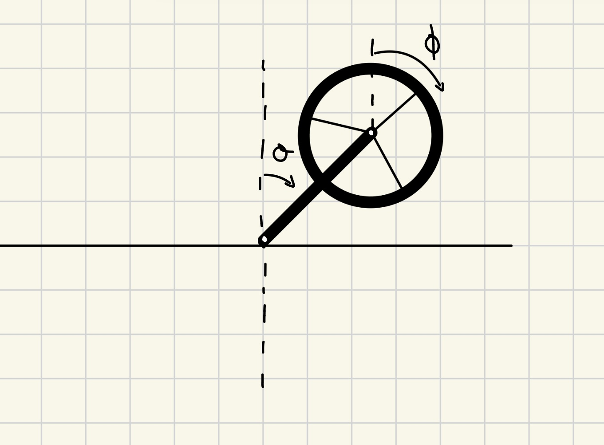

# Reaction Wheel Inverted Pendulum

This project investigates the modeling and control of a reaction wheel inverted pendulum.  
The objective is to stabilize the unstable upright equilibrium using state-feedback control.

---

## System Overview

The system consists of a rigid pendulum of length ( $l$ ) with a reaction wheel mounted at its end.
A motor applies torque ($\tau$) to the wheel, generating a reaction torque on the pendulum.
The upright configuration ( $\theta = 0$ ) is an unstable equilibrium.

---

## Modeling

The equations of motion were derived using Lagrangian mechanics and include nonlinear gravitational effects.
The dynamics were linearized about the upright equilibrium under a small-angle assumption
( $\sin\theta \approx \theta$ ).

The state vector was chosen as:
$$\[
x = [\theta,\ \dot{\theta},\ \dot{\phi}]^\top
\]$$
where the absolute wheel angle was omitted since it does not affect the dynamics.

---

## Control Design

A Linear Quadratic Regulator (LQR) was designed for the linearized state-space model.
The controller computes a full-state feedback law:
$\[
\tau = -Kx
\]$
which minimizes a quadratic cost balancing state deviation and control effort.

Closed-loop eigenvalue analysis confirmed asymptotic stability of the linearized system.

---

## Simulation Results

The LQR controller was evaluated on both the linearized model and the full nonlinear dynamics.
Simulations were performed for increasing initial angular deviations (up to 0.5 rad).

The controller remained stabilizing beyond the nominal small-angle regime; however,
larger initial deviations resulted in significantly increased control torque at early times.
This highlights a key limitation of unconstrained optimal control and motivates the inclusion
of actuator saturation in future work.

---

## Limitations and Future Work

- Actuator torque limits are not explicitly enforced
- State estimation (e.g., Kalman filtering) is not yet implemented
- Performance degrades for large initial deviations due to nonlinear effects

Future extensions include torque saturation, state estimation, and hardware implementation.

---

## Repository Structure

- `notebooks/` — Jupyter notebooks for modeling, control design, and simulation
- `figures/` — Plots and system schematics
- `report/` — LaTeX source for the technical write-up (Overleaf-compatible)
