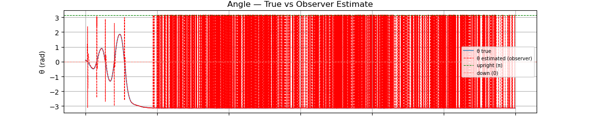

# Reaction-Wheel Inverted Pendulum

A reaction-wheel-actuated pendulum stabilised at its unstable upright equilibrium using a two-phase controller: bang-bang energy shaping for swing-up and a discrete LQR with Luenberger observer for stabilisation. Implemented on an STM32F446RE Nucleo running at 500 Hz using STM32 HAL.

> **Status:** Simulation complete. Hardware build in progress.

---

## Demo

*Video coming once hardware build is complete.*

Simulation result (30 s run, $\theta_0 = 0.1$ rad):



---

## Why This Problem Is Hard

The system has two degrees of freedom (pendulum angle $\theta$, wheel angle $\varphi$) but only one control input (motor torque $\tau$). This underactuation means a single controller cannot handle the full range of motion:

- **Large angles:** the linearisation breaks down entirely — $\sin\theta \neq \theta$
- **Near upright:** the equilibrium is open-loop unstable (eigenvalues $\pm 5.7$ rad/s)
- **No velocity sensor:** $\dot{\theta}$ is not directly measured; it must be estimated

A single LQR cannot swing the pendulum up from rest. A single energy controller cannot stabilise the upright. The solution requires two controllers and a principled switch between them.

---

## Controller Design

### Phase 1 — Bang-Bang Swing-Up

A bang-bang energy pump drives the pendulum from rest toward the upright equilibrium. The control law applies full motor voltage in the direction that adds mechanical energy:

$$
\tau = \begin{cases} -V_{\text{supply}} \cdot \text{sign}(\dot{\theta}) & \text{if } E < E^* \\ 0 & \text{if } E \geq E^* \end{cases}
$$

where $E^* = mgl$ is the target energy (upright with zero velocity) and the current energy is:

$$E = \tfrac{1}{2}ml^2\dot{\theta}^2 - mgl\cos\theta$$

Torque is cut once sufficient energy has accumulated; the pendulum coasts toward the top where LQR engages. A small initial kick ($0.3 \cdot V_{\text{supply}}$) handles the degenerate case where $\dot{\theta} \approx 0$ at startup.

### Phase 2 — Discrete LQR

Near the upright equilibrium, the nonlinear system is linearised by substituting $\delta = \theta - \pi$ (deviation from upright) and using $\sin(\pi + \delta) \approx -\delta$:

$$\ddot{\delta} \approx \frac{g}{l}\delta - \frac{2}{ml^2}\tau$$

This gives a 2-state controllable system $\mathbf{x} = [\delta,\; \dot{\delta}]^\top$. The LQR minimises:

$$J = \sum \left(\mathbf{x}^\top Q\mathbf{x} + R\tau^2\right)$$

with $Q = \text{diag}(20,\, 2)$, $R = 1$. The plant is discretised via zero-order hold at 500 Hz before solving the discrete algebraic Riccati equation.

**Why not design LQR on the full 3-state system $[\theta,\, \dot{\theta},\, \dot{\varphi}]$?** The controllability matrix of the full system has rank 2 — $\dot{\varphi}$ is uncontrollable from $\tau$. Including it in the LQR produces a spurious gain on an unobservable state.

### Switching Condition

LQR engages when both:
- $|\hat{\delta}| < 0.5$ rad (estimated deviation from upright)
- $|\dot{\hat{\delta}}| < 4.0$ rad/s (estimated angular velocity)

Estimates come from the Luenberger observer, not raw measurements.

### Luenberger Observer

The encoder measures $\theta$ with noise ($\sigma \approx 0.02$ rad). Angular velocity $\dot{\theta}$ is not directly sensed. A discrete Luenberger observer runs at 500 Hz alongside the controller:

$$
\begin{aligned}
\hat{\mathbf{x}}[k+1] &= A_d\hat{\mathbf{x}}[k] + B_d\tau[k] \quad \text{(prediction)}\\
\hat{\mathbf{x}}[k] &= \hat{\mathbf{x}}[k] + L\!\left(\delta_{\text{meas}} - \hat{x}_0[k]\right) \quad \text{(correction)}
\end{aligned}
$$

Observer poles are placed at $z = e^{-40\,\Delta t}$ and $z = e^{-60\,\Delta t}$ — roughly 3–5× faster than the closed-loop poles, following standard observer design rules. This gives the observer gain $L = [0.190,\; 4.419]^\top$.

The observer is what makes the LQR switching condition reliable. Using raw encoder position alone to decide when to switch would cause false triggers from measurement noise.

---

## Hardware

| Part | Qty | Notes |
|------|-----|-------|
| STM32F446RE Nucleo-64 | 1 | Already owned |
| Pololu 25D HP 12V bare motor with 48 CPR encoder (item #4840) | 1 | No gearbox — motor shaft drives reaction wheel directly. Integrated Hall effect encoder, no separate mounting needed. |
| TB6612FNG dual H-bridge breakout (SparkFun or Adafruit) | 1 | Only one channel used (PWMA / AIN1 / AIN2). Logic identical to DRV8833 — same STM32 pin assignments. |
| AMT103-V encoder kit | 1 | Quadrature A/B mode, DIP switch position 10 = 2048 PPR. The -V suffix means it ships as a kit with all sleeve sizes (2–8mm) included — use the sleeve that matches your pivot shaft. |
| 12V 2A power supply | 1 | Start at 3V during bring-up |


### Motor Parameters
We will be using the HP 12V Motor with 48 CPR Encoder for 25D 

| Parameter | Value | Source |
|-----------|-------|--------|
| $K_t$ (torque constant) | 0.03 Nm/A | Estimated |
| $K_e$ (back-EMF constant) | 0.00954 V·s/rad | Estimated |
| $R_m$ (winding resistance) | 2.4 Ω | Estimated |
| Stall torque @ 12V | ~0.15 Nm | Derived |

**These will be measured on hardware** before tuning the controller. The observer and LQR gains depend on $K_t$ being accurate.

---

## Repository Structure

```
├── report.pdf                          Full derivation (Lagrangian, LQR, observer design)
├── simulations/
│   └── Sim_v9_added-discretization.ipynb   Simulation with plots
├── Software/
│   └── pendulum_main.ino           older simple FOC implementation used as a basis
│   └── pendulum_main_arduino       all components necessary to the STM32 HAL abstraction level         
└── README.md
```

### Simulation

We are using the control library:
```bash
pip install numpy scipy matplotlib control
```

### Firmware
We are rewriting the firmware in STM 32 HAL. I also left the Arduino implementation as a starting point.
## Firmware Constants

These are the gains to be used in firmware that we got from the V9 sim these constants are to be adjusted with the hardware.

```c
const float Kd[2]    = {-4.976694f, -1.404655f};
const float Ad[2][2] = {{1.000065f, 0.002000f}, {0.065401f, 1.000065f}};
const float Bd[2]    = {-0.000089f, -0.088891f};
const float Ld[2]    = {0.190094f,  4.418506f};
const float dt       = 0.0020f;  
```

---

## Design Decisions


**Why a Luenberger observer rather than a complementary filter?**

A complementary filter on encoder + differentiated position is simple but introduces a tuning parameter (cutoff frequency) with no principled connection to the system dynamics. The Luenberger observer poles are placed explicitly relative to the closed-loop poles, and the gain derivation falls directly out of the same state-space framework used for the LQR. Everything stays consistent. In short, we are keeping everything based on physics/math to stay consistent with our use of LQR instead of using a hand tuned system.
---

## Planned Extensions

- [ ] Hardware build and experimental validation
- [ ] Measure motor parameters ($K_t$, $K_e$, $R_m$) directly
- [ ] Characterise encoder noise floor (connects observer $\sigma_{\text{angle}}$ assumption to real data)
- [ ] Bare-metal STM32 HAL rewrite with custom FOC implementation
- [ ] Extended Kalman Filter replacing Luenberger observer

---

## References

- [SimpleFOC Reaction Wheel Reference Project](https://github.com/simplefoc/Arduino-FOC-reaction-wheel-inverted-pendulum)
- [SimpleFOC Library Documentation](https://docs.simplefoc.com/)
- Åström & Furuta, *Swinging up a Pendulum by Energy Control* (1996)